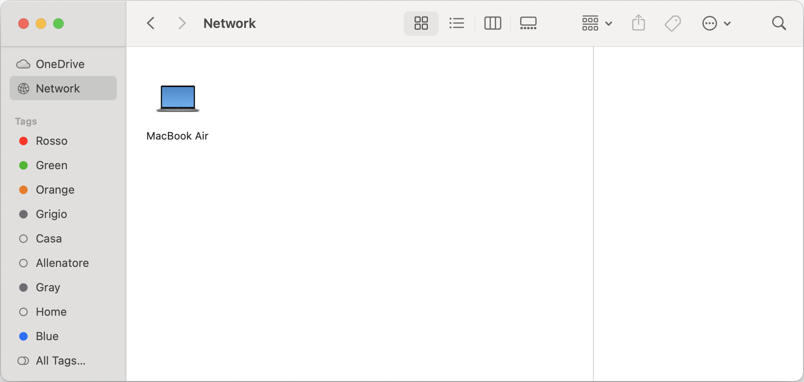

# Apple Silicon Logical Acquisition Script

The Apple Silicon Logical Acquisition (ASLA) script in this repository is a bash script called `asla.sh` designed for performing logical acquisition of Apple Silicon Mac devices. 
This script facilitates the collection of data from an Apple Silicon Mac in a forensically-sound manner.

## Description

To transfer files from an Apple Silicon Mac device to another Mac, you can leverage the _share disk mode_, which turns the system into an [SMB file sharing server](https://www.macrumors.com/how-to/transfer-files-apple-silicon-mac-to-mac/), providing another Mac device connected to it with file-level access to user data. 
Therefore, it is not possible creating a proper forensic image of an Apple Silicon Mac, but only performing a logical acquisition of the shared disk, assuming that the password is not needed or is known by the examiner, by relying on a command-line tool which copies the contents from source to destination.

The ASLA script is a bash script designed to facilitate the forensically-sound logical acquisition of data from Apple Silicon Mac devices. 
ASLA is a simple bash script, structured in functions, written with a focus on maintaining read-only access to data, which provides a streamlined solution for collecting data from Apple Silicon Macs. 
With interactive prompts and detailed logging, ASLA ensures a reliable and transparent acquisition process suitable for forensic activities and data analysis.
It also provides the possibility to run in _assisted mode_, to help you in identifying the targeted Apple Silicon Mac started in share disk mode and connected to your Mac device used for the acquisition.

### Getting started
1. Download the `asla.sh` script from this repository or clone it to your Mac device.
2. Ensure that the script has executable permissions:
   ```
   % git clone https://github.com/giuseppetotaro/asla
   % cd asla
   % chmod +x ./asla.sh
   ```
3. Run the script:
   ```
   % ./asla.sh /path/to/target /path/to/destination
   ```
4. Follow on-screen instructions if executed in assisted mode, which will guide you through the acquisition process.
5. Once the acquisition process is complete, the script will provide a summary of the operation and the location of the acquired data.

### Procedure

Sharing the disk of an Apple Silicon Mac device (i.e., share disk mode) is a crucial step in performing logical acquisitions. While the procedure is officially documented by [Apple](https://support.apple.com/guide/mac-help/transfer-files-a-mac-apple-silicon-mchlb37e8ca7/mac), based on practical experience, there are certain nuances and tricks that can streamline the process and mitigate potential challenges. 
This section will provide comprehensive instructions to effectively enable share disk mode on Apple Silicon Mac devices. 
By following these steps, you can confidently initiate the share disk mode and proceed with the logical acquisition:

* _Host_: the Mac device used for the acquisition, where the script is executed.
* _Target_: the Mac device to be acquired, started in share disk mode.

1. The target must be started in Recovery Mode (press and hold power button).
2. Selecting _Options_ opens macOS Recovery.
3. If requested, enter the password for an administrator account.
4. From the menu on the top, select _Utilities_ > _Share Disk_ to start sharing.
5. If the disk is locked with File Vault, it must be unlocked by entering the password.
6. Ensure the host is powered on be and connected to power charger, before connecting to the target.
7. Power supply to the target should be provided only after connecting to the host (it has been experienced that an Apple Silicon Mac is not seen if it is already connected to the power supply).
8. Connect from a USB-C port on the target to a USB-C port on the host via USB or [Thunderbolt 3 (TB3) cable](https://support.apple.com/en-us/111750).
9. Onve connected, you should hear a sound which means that (most probably) the target is connected to the host.
10. Connect the target with power supply.
11. With Finder, select _Go_ > _Network_ (or press SHIFT+CMD+K) and check if you see target's name (e.g., MacBook Air), as you can see below.



To ensure the shared disk is mounted in read-only mode, users can utilize the `asla.sh` in assisted mode (`-a` option), which helps in identifying the target and automatically mounts the shared disk in read-only mode:

```
./asla.sh -a TARGET DESTINATION
```

or

```
./asla.sh -a -n "MacBook Air" -u username -p password TARGET DESTINATION
```

or 

```
./asla.sh -a -n "MacBook Air" -u Guest --no-password TARGET DESTINATION
```

where `TARGET` and `DESTINATION` are the paths to the mount point of the target's shared disk and the location (preferably external) where the acquisition will be saved respectively.

## Installation

This script can be executed in Terminal and would not need any specific software besides those already provided in macOS.
However, it is highly recommended that you have the [Xcode Command Line Tools](https://developer.apple.com/xcode/) installed on your system.

To install the Xcode Command Line Tools, you can enter the command `xcode-select --install` in the Terminal.

This script has been tested on macOS Sonoma (Version 14.3) with the Xcode Command Line Tools installed.

## Usage

The `asla.sh` script offers a concise but effective help message using the `-a` option as follows:

`% ./asla.sh -h`

```
ASLA (Apple Silicon Logical Acquisition)  version 1.0
Copyright (c) 2024 Giuseppe Totaro
GitHub repo: https://github.com/giuseppetotaro/asla

asla.sh is provided "as is", WITHOUT WARRANTY OF ANY KIND. You are welcome to 
redistribute it under certain conditions. See the MIT Licence for details.

asla.sh is a bash script to perform the logical acquisition of data from the 
targeted Apple Silicon Mac started in "share disk mode".

Usage:  ./asla.sh [OPTION]... TARGET DESTINATION

TARGET       path to the target (i.e., the mount point of the Mac's shared disk 
             to be acquired).
DESTINATION  path to the folder where the sparse image used as destination will 
             be created.

If the target is a path to a non-existing folder, the script will run in 
assisted mode (equivalent to using the -a option) to identify the target.

Examples:
  ./asla.sh /Volumes/ShareDisk /Volumes/ExternalDrive
  ./asla.sh -a -c /tmp/target /Volumes/ExternalDrive
  ./asla.sh -n "MacBook Air" -u user -p password /tmp/target /Volumes/Dest
  ./asla.sh -i MyAcquisition -s 500 /Volumes/ShareDisk /Volumes/Dest
  ./asla.sh -t rsync /Volumes/ShareDisk /Volumes/ExternalDrive

Options:
  -h, --help                 print this help message
  -a, --assisted             run the script in assisted mode
  -c, --calculate-hash       calculate MD5 and SHA1 hashes of the sparse image
  -i, --image-name <name>    name of the sparse image (without extension)
  -n, --name <name>          computer name of the target (only in assisted mode)
      --no-password          no password will be used (only in assisted mode)
  -p, --password <password>  password of the target (only in assisted mode)
  -s, --size <number>        size of the sparse image in KB, otherwise it will 
                             be calculated based on the size of the target
  -t, --tool <cp|rsync>      tool for the acquisition (cp is the default)
  -u, --user <name>          username of the target (only in assisted mode)
```

## Contributing

Contributions to this project are welcome! If you encounter any issues, have suggestions for improvements, or would like to contribute new features, please feel free to submit a pull request or open an issue on GitHub.

Please try to structure your code into functions. If you want to add a new function to the script, please consider that any function that is neither obvious nor short must be commented, using the function comments suggested in the [Shell Style Guide](https://google.github.io/styleguide/shellguide.html#s4-comments).

## Authors and Acknowledgments

This script was developed by Giuseppe Totaro based on extensive experience in the field of digital forensics.

Special thanks to the following colleagues for their invaluable insights, feedback, and testing contributions:

- Israel Gordillo Torres
- Francesco Cappotto
- Sammy Nieuwborg

Their expertise and dedication greatly enhanced the quality and reliability of this script.

## License

This project is licensed under the [MIT License](LICENSE). Feel free to modify and distribute the script according to the terms of this license.
